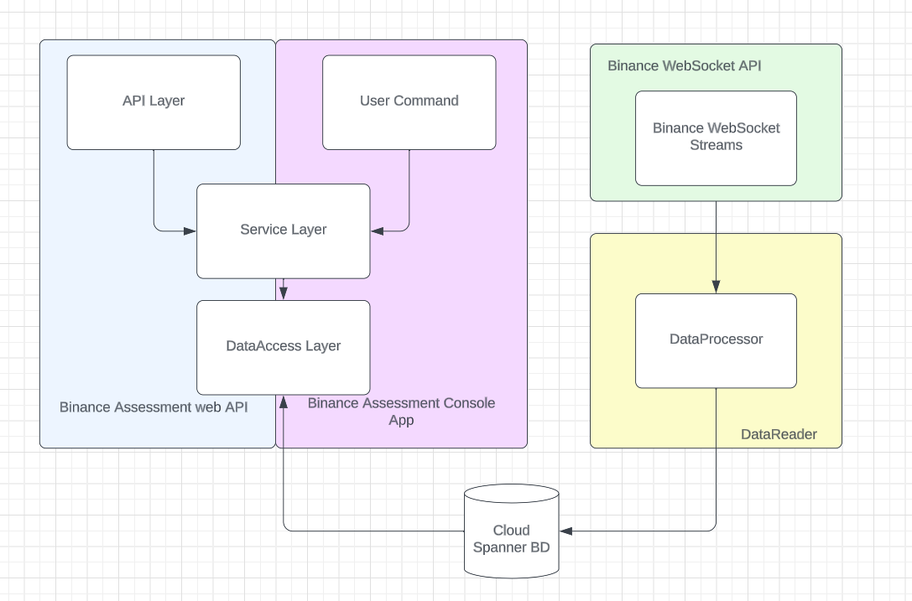
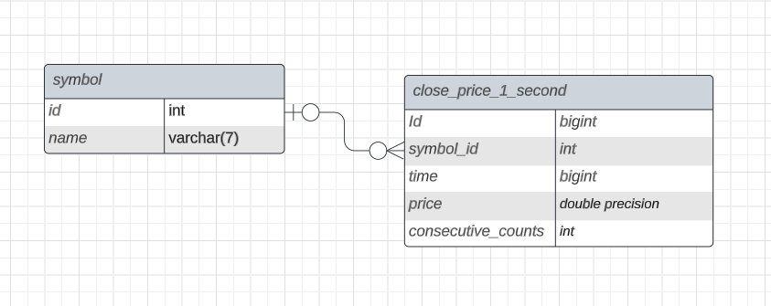

# Binance-WebSocket-Task

# Table of contents
1. [Goal and Purpose of the application](#goal-and-purpose-of-the-application)
2. [Structure](#structure)
3. [Architecture](#architecture)
4. [Project set up](#project-set-up)
5. [Used technologies](#used-technologies)

---
## Goal and Purpose of the application
This is a tool that allows the user to check the latest tendencies in one of three cryptocurrencies - **BTCUSDT**, **ADAUSDT**, and **ETHUSDT**. Available functionality is the average price of one of the tickers calculated over the last 24 hours, and the other one is a calculation of the Simple Moving Average for s specified ticker.

---
## Structure 
| Service | Purpose |        
--- | --- 
| **WebAPI** | Can be integrated with a client app to produce a new web application |      
| **Console Application** | Provides the same functionality as the webAPI |
| **DataReader** | Responsible for connecting to the web sockets provided by Binance WebSockets API and saving the incoming data to the database |

1. WebAPI endpoints
* `GET /api/{symbol}/24hAvgPrice` - Returns the average price for the last 24h of data in the database ( or the oldest available, if 24h of data is not available )
   * `{symbol}` - The symbol the average price is being calculated for
  
* `GET /api/{symbol}/SimpleMovingAverage?n={numberOfDataPoints}&p={timePeriod}&s=[startDateTime]` - Return the current Simple Moving average of the symbol's price
  * `{symbol}` - The symbol the average price is being calculated for
  * `n` - The amount of data points
  * `p` - The time period represented by each data point. Acceptable values: `1w`, `1d`, `30m`, `5m`, `1m`
  * `s` - The datetime from which to start the SMA calculation ( a date )

The WebAPI accepts and returns both *application/xml* and *application/json*, based on the `Accepts` header in the request and produces a `Content-Type` header in the response. There is a validation on every parameter and if they are not passed correctly, the API will return `400 BadRequest`. The API is also using InMemoryCache for storing SMA data for as long as the application is up and running. 

2.Console Application 
* The console application has the same functionality as the Web API, except it doesn't support caching. Available commands in the console app are:
 * `24h {symbol}` - provides the same functionality as the `api/{symbol}/24hAvgPrice` endpoint
 * `sma {symbol} {n} {p} {s}` - provides the same functionality as the `/api/{symbol}/SimpleMovingAverage` endpoint
Note that there is also validation on every parameter and it will throw an ArgumentException with a meaningful message if one of the parameters is not in the correct format.

 3.DataReader job
 * This background job is responsible for connecting to every `{symbol}@kline_1s` stream from Binance's streams and then processing the messages and saving them to the database. The selected database is *Google Cloud Spanner with PostgreSQL*.
   * This is an example message that the kline stream is sending:
      ```json
      {
	       "e": "kline",
	       "E": 1696087303001,
	       "s": "BTCUSDT", --symbol
	       "k": {
		          "t": 1696087302000,
		          "T": 1696087302999, --close time
		          "s": "BTCUSDT",
		          "i": "1s",
		          "f": 3224143423,
		          "L": 3224143424,
		          "o": "27043.21000000",
		          "c": "27043.21000000",  -- price at close time
		          "h": "27043.21000000",
		          "l": "27043.21000000",
		          "v": "0.00720000",
		          "n": 2,
		          "x": true,
		          "q": "194.71111200",
		          "V": "0.00000000",
		          "Q": "0.00000000",
		          "B": "0"
	       }
      }
      ```
      Since all of the calculations are done using the price at close time, only the `s`, `T`, and `c` are extracted from the stream and saved into the database.


---
## Architecture
### Solution architecture diagram


### Database diagram


---
## Project set up
1. Prerequisites
   * [.NET 7 SDK](https://dotnet.microsoft.com/en-us/download/dotnet/thank-you/sdk-7.0.401-windows-x64-installer)
   * Visual Studio 2022
   * a JSON file with credentials for access to the database (not in the repo, will be sent additionally)
3. Steps
   * Clone the repo and open the *Binance.Assessment.sln*
   * Download the .json file from the email and place it ***in the same folder as the Binance.Assessment.sln*** If they are not in the same directory, the code will not work.
   * From the dropdown menu on the upper center of Visual Studio, select either `Binance.Assessment.API` or `Binance.Assessment.Console` and press `F5`/`Ctrl+F5`
    * If the API is selected, on the first run a popup may appear asking if you trust the SSL certificate - click `Yes`

---
## Used technologies
* The services are built on `.NET Core 7`.
 The technologies used are `Google Cloud Platform` and `ASP.NET Core`
* The `DataReader` job is of type `Background Service`
